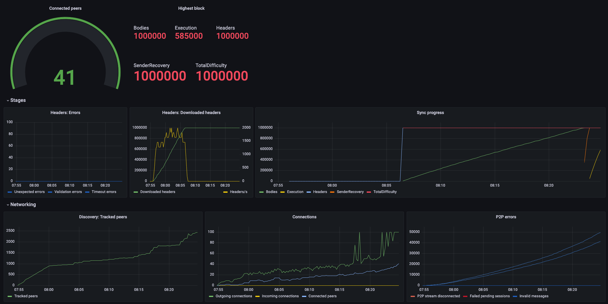

# Reth Quick Start
Run the latest [Reth](https://github.com/paradigmxyz/reth) node locally and monitor it with a Prometheus-powered Grafana dashboard.

## Starting up
1. Install Docker and Docker Compose
2. Clone this repository `git clone git@github.com:loren/local_reth.git`
3. `cd local_reth`
4. Run `docker-compose up -d`
5. Verify the node has started up by running `docker-compose logs -f reth`
6. Run `./watch.sh` to see the stats that Prometheus is collecting
7. Open "http://localhost:3000" in your browser and log into Grafana w/ user: "admin", pass: "admin" to view the "reth" dashboard

## What's happening

By default, the `docker-compose.yml` file will run a Reth node that 
will sync up to [Ethereum block 5,000,000](https://etherscan.io/block/5000000). 
This is a good place to start if you want to test out Reth and don't want to wait for the full sync. 
You can override this by setting the `RETH_TIP` environment variable to a different block number hash.

The `docker-compose.yml` file also spins up a Prometheus server and a Grafana server. 
The Prometheus server will scrape the Reth node and the Grafana server will display the metrics in a dashboard.



## Interacting with the data

Once the Reth node has had a chance to sync up, you can interact with the data in the Reth node by using the `db` subcommand.

### Logging into the Reth node

```shell
docker exec -it local_reth-reth-1 bash
```

### Listing the tables
```shell
reth/target/release/reth db stats
```

### Viewing some records
```shell
reth/target/release/reth db list --start=1 --len=2 Headers
```

## Shutting down
1. Run `docker-compose down`

The volumes will persist across restarts, so you can start and stop the node as needed.

---

## Acknowledgements

The Reth repo / binary in use here is maintained at https://github.com/paradigmxyz/reth

The Prometheus + Grafana docker-compose stack is taken from https://github.com/vegasbrianc/prometheus
