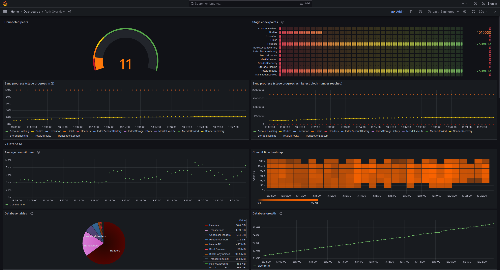
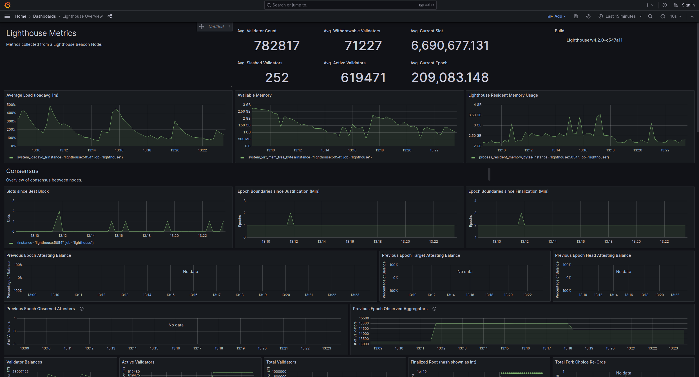

# Fork Features
This fork of Loren's local_reth repo adds the following features:
- Add Lighthouse client to the docker-compose.yml file
- Add Lighthouse dashboard to Grafana
- Reth syncs to latest chain head, by default
- Reth uses maxperf profile and jemalloc, by default
- Enabled http RPC on both Lighthouse & Reth
- Disabled grafana login (no usernames/passwords required)
- Included Lighthouse metrics in watch.sh script

# Reth Quick Start
Run the latest [Reth](https://github.com/paradigmxyz/reth) node locally and monitor it with a Prometheus-powered Grafana dashboard.

## Starting up
1. Install Docker and Docker Compose
2. Clone this repository `git clone https://github.com/gibz104/local_reth.git`
3. `cd local_reth`
4. Run `docker-compose up -d`
5. Verify the node has started up by running `docker-compose logs -f reth`
6. Run `./watch.sh` to see the stats that Prometheus is collecting
7. Open "http://localhost:3000" in your browser to view the "Reth Overview" & "Lighthouse Overview" dashboards

## What's happening

By default, the `docker-compose.yml` file will run both a Reth node (EL) and a Lighthouse node (CL) that 
will sync up to the current chain head.

The `docker-compose.yml` file also spins up a Prometheus server and a Grafana server. 
The Prometheus server will scrape the Reth and Lighthouse nodes and the Grafana server will display the metrics in 
their respective dashboards.





## Interacting with the data

Once the Reth node has had a chance to sync up, you can interact with the data in the Reth node by using the `db` subcommand.

### Logging into the Reth node

```shell
docker exec -it reth bash
```

### Listing the tables
```shell
reth/target/maxperf/reth db stats
```

### Viewing some records
```shell
reth/target/maxperf/reth db list --start=1 --len=2 Headers
```

## Shutting down
1. Run `docker-compose down`

The volumes will persist across restarts, so you can start and stop the node as needed.

---

## Acknowledgements

The Reth repo / binary in use here is maintained at https://github.com/paradigmxyz/reth

The Prometheus + Grafana docker-compose stack is taken from https://github.com/vegasbrianc/prometheus

Reth Grafana dashboard taken from https://github.com/paradigmxyz/reth/blob/main/etc/grafana/dashboards/overview.json

Lighthouse Grafana dashboard taken from https://github.com/sigp/lighthouse-metrics/blob/master/dashboards/Summary.json
